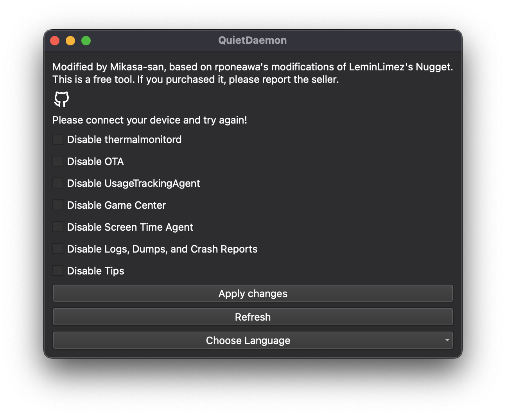

# QuietDaemon

A tool used to disable various daemons on iOS devices to prevent throttling, screen dimming, and other behaviors when devices overheat. This tool can disable:

- **Disable thermalmonitord**
- **Disable OTA**
- **Disable UsageTrackingAgent**
- **Disable Game Center**
- **Disable Screen Time Agent**
- **Logs, Dumps, and Crash Reports**

More daemons will be added in the future.

Works on all versions below 18.1; note that thermal throttling may not be completely disabled on A15+ devices.



## Running the Program

To execute the code, follow these steps:

### Requirements:
- `pymobiledevice3`
- Python 3.8 or newer

**Note:** It is highly recommended to use a virtual environment:

```
python3 -m venv .env # only needed once
# macOS/Linux:  source .env/bin/activate
# Windows:      ".env/Scripts/activate.bat"
pip3 install -r requirements.txt # only needed once
python3 gui_app.py
```
Note: It may be either `python`/`pip` or `python3`/`pip3` depending on your path.

**Find My should be turned off to use this tool.**

**Please note that the iPhone battery will be displayed as an unknown part/unverified in Settings after disabling thermalmonitord.**

## Credits
- Modified Again from [rponeawa](https://github.com/rponeawa)/[thermalmonitordDisabler](https://github.com/rponeawa/thermalmonitordDisabler)
- Modified from [leminlimez](https://github.com/leminlimez)/[Nugget](https://github.com/leminlimez/Nugget)
- [JJTech](https://github.com/JJTech0130) for Sparserestore/[TrollRestore](https://github.com/JJTech0130/TrollRestore)
- [pymobiledevice3](https://github.com/doronz88/pymobiledevice3)
